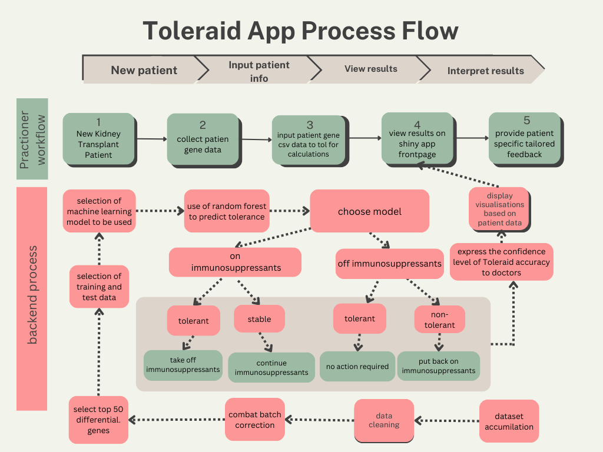
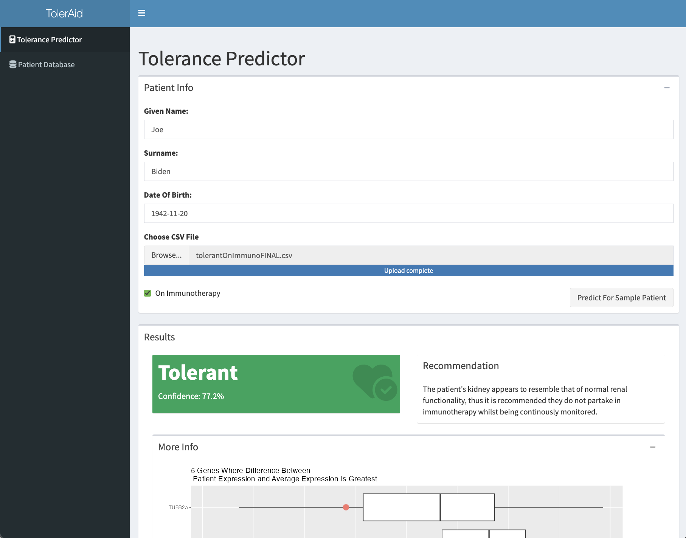
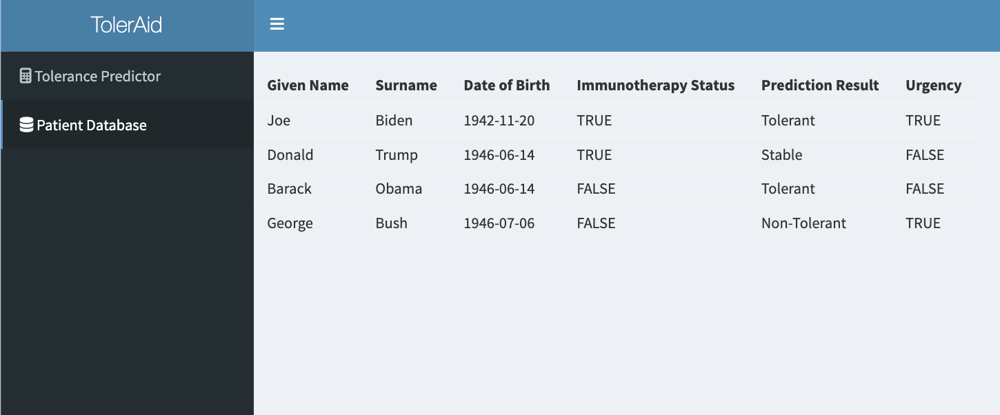

# Executive Summary

When a kidney transplant patient eventually goes off of immunosuppresant drugs after their surgery, they will either go on to reject their kidney or become tolerant of their new kidney. Being on immunosuppressants for longer than strictly necessary has negative health effects including a high risk of cancer. Our project created an app for doctors to use which uses modelling to predict whether their patient will be tolerant based on easy-to-collect blood gene expression data. This technology could be used in a clinical setting to help doctors find which patients can be taken off of immunotherapy, potentially reducing the time patients spend on immunosupressants and decreasing side-effects like cancer.\n

All code for this project can be found on our GitHub: <https://github.sydney.edu.au/Snol5430/DATA3888_KidneyA16>

# Introduction and Background
Kidney transplantation is the preferred treatment option for patients with end-stage renal disease as it prolongs and improves the lives of said patients (Abramyan & Hanlon, 2021). However, matching a donor’s kidney with the recipient involves several considerations as the donor’s kidney can act as an alloantigen. When transplanting a tissue or cell from a genetically different donor, the donor’s alloantigen induces an immune response (Naik & Shawar, 2020). In other words, the patient’s immune system will recognize a non-self antigen in the allograft and if not controlled, this response can destroy the graft over time. This process is also referred to as allograft rejection. \n

In order to lower the body’s ability to reject the graft, renal transplant patients undergo immunosuppressive therapy and are given the standard regimen of immunosuppressive drugs. Renal transplant patients typically need to be on immunosuppressive drugs for the lifetime of the transplant. Yet the duration of immunosuppressive therapy may vary from one patient to another depending on individual health factors and the specific transplant program’s protocol. When taken off immunosuppressive drugs, some patients would reject the transplanted kidney and some are tolerant. In the context of renal transplantation, a patient is considered tolerant when the patient maintains stable renal function and shows no signs of rejection for at least one year after the complete withdrawal of immunosuppression (Podestà & Sykes, 2022). \n 

While immunosuppressive drugs have proven to reduce the risk of allograft rejection, they have a wide range of side effects. According to Faravelli et al. (2021), chronic immunosuppression may cause neurological symptoms through direct neurotoxic effects which may potentially cause the development of tumors and infections. Additionally, immunosuppression is also known to potentially cause devastating consequences in terms of cardiovascular diseases (Podestà & Sykes, 2022). All of which may severely impair the recipient’s quality of life. 


# Aim
Based on the searched information, a Shiny application is created which predicts tolerance from peripheral blood datasets. The primary goal of this application is to mitigate the side effects associated with immunosuppression. It is also designed to provide doctors with early information on a patient’s tolerance status which can assist them in making informed decisions regarding the continuation or discontinuation of immunosuppressive drugs. This approach may enable patients to safely reduce and or eliminate their dependence on immunosuppression if deemed necessary and appropriate. Ultimately, this application aims to reduce the risk of immunosuppression-related side effects, optimize patient care, and improve long-term outcomes in renal transplant patients.

# Methods
## Overview
```{r figure-1} 
 
```
\n


Figure 1: Overview of project workflow, including both the backend process that went into making our app and the process a potential end user would go through to use our app.


## Data Collection and Merging
```{r, warning=FALSE,message=FALSE}
library(GEOquery)
library(stringr)
library(ggplot2)
library(ggplot2)
library(dplyr)
library(sva)
seed=40
```
### Dataset Collection
To identify potential datasets for the project, we first did a search of the literature using keywords relevant to the subject area such as “kidney graft”, “tolerance”, “biomarkers”, and “peripheral blood.” Through this, 6 published datasets were identified with microarray gene expression data for tolerant and non-tolerant patients (data accessible at NCBI GEO database (Edgar et al., 2002), accession numbers GSE45593, GSE22229, GSE47755, GSE14655, GSE145408, and GSE22707).


### Dataset Selection
Since the 6 found datasets contained expression data for different combinations of genes, we tried to find common genes across different databases. All of the datasets have 2 main components, one is the expression data which contains information about how much each gene was expressed by each patient, the other is the phenotype data which demonstrates other information about each patient, including their tolerance status. The expression data from each dataset has unique names for each gene, so we need to standardize these names to compare them. Luckily, each dataset also has a list of “Gene Symbols” corresponding to each gene which are their standard names. Using this, we can find out which datasets have the most overlap in genes so we can choose which ones will be best to use.\n


```{r,message=FALSE}
#loading in datasets
load("data/GSE45593")
load("data/GSE22229")
load("data/GSE47755")
load("data/GSE14655")
load("data/GSE145408")
load("data/GSE22707")
GSE45593raw<-GSE45593
GSE45593 <- GSE45593raw[[1]]
GSE22229_eMat<-exprs(GSE22229$GSE22229_series_matrix.txt.gz)
GSE145408_eMat<-exprs(GSE145408$GSE145408_series_matrix.txt.gz)
GSE47755_eMat<-exprs(GSE47755$GSE47755_series_matrix.txt.gz)
GSE14655_eMat<-exprs(GSE14655$GSE14655_series_matrix.txt.gz)
GSE22707_eMat<-exprs(GSE22707$GSE22707_series_matrix.txt.gz) 
GSE45593_eMat<-exprs(GSE45593)

```

```{r}
#extracting gene symbols

#for each of the above datasets, replace the temporary gene id with the gene symbol 
#the list of gene symbols is found in a different place in almost every dataset so the code varies for each one. The end product is the same though: expression matrix with the row names replaced with the gene symbols.

#GSE45593 was the most troublesome, but the below code (as complex as it may seem) was successful in replacing the row names

idx <- fData(GSE45593)$gene_assignment != "---"
GSE45593 <- GSE45593[idx,]
GSE45593symbols=unlist(lapply(strsplit(fData(GSE45593)$gene_assignment, " // ", 1), `[`, 2))
idx_gene <- which(!is.na(GSE45593symbols) & !duplicated(GSE45593symbols))
GSE45593 <- GSE45593[idx_gene,]

GSE45593_eMat=exprs(GSE45593)
rownames(GSE45593_eMat) = GSE45593symbols[idx_gene]
#the rest of the datasets were more straightforward
GSE47755symbols<-GSE47755$GSE47755_series_matrix.txt.gz@featureData@data$GENE_SYMBOL
rownames(GSE47755_eMat)=GSE47755symbols
GSE22229symbols<-str_split_i(GSE22229$GSE22229_series_matrix.txt.gz@featureData@data$`Gene Symbol`, " /// ", 1)
rownames(GSE22229_eMat)=GSE22229symbols
GSE14655symbols<-str_split_i(GSE14655$GSE14655_series_matrix.txt.gz@featureData@data$SeqName, ";", 1)
rownames(GSE14655_eMat)=GSE14655symbols
GSE145408symbols<-str_split_i(GSE145408$GSE145408_series_matrix.txt.gz@featureData@data$`Gene Symbol`, " /// ", 1)
rownames(GSE145408_eMat)=GSE145408symbols
GSE22707symbols<-str_split_i(GSE22707$GSE22707_series_matrix.txt.gz@featureData@data$`Gene Symbol`, " /// ", 1)
rownames(GSE22707_eMat)=GSE22707symbols
```

To achieve this, we created a function that looked at every possible number of datasets (1 through 6) and figured out which of our available datasets would have the largest number of overlapping genes while including the given number of datasets.


```{r}

#comparing list of genes between datasets to find the datasets with the most overlap for each possible number of datasets


listoflists=list(GSE47755symbols,GSE22229symbols,GSE14655symbols,GSE145408symbols,GSE22707symbols,GSE45593symbols)
names(listoflists)=c("GSE47755symbols","GSE22229symbols","GSE14655symbols","GSE145408symbols","GSE22707symbols","GSE45593symbols")
number_of_genes=c()
best_combos=c()
for(i in 1:length(names(listoflists))){
  combos=combn(names(listoflists),i)
  number_of_combos=dim(combos)[2]
  best_combo=NA
  best_combo_number=-Inf
  for(j in 1:number_of_combos){
    set=combos[,j]
    intersection=Reduce(intersect,listoflists[set])
    if(length(intersection)>best_combo_number){
      best_combo=str_remove_all(paste(set, collapse=" "), "symbols")
      best_combo_number=length(intersection)
    }
    
  }
  #print(paste("Best combination of ", toString(i)," datasets:"))
  #print(paste(toString(best_combo)," with ",toString(best_combo_number), " genes in common"))
  number_of_genes=c(number_of_genes, best_combo_number)
  
  best_combos=c(best_combos, best_combo)
}

optimisation_df=data.frame(number_of_datasets=1:6,number_of_overlapping_genes=number_of_genes, optimal_datasets=best_combos)
ggplot(data=optimisation_df, aes(x=number_of_datasets, y=number_of_overlapping_genes))+geom_line()+labs(y="number of genes found across all optimal datasets", x= "number of datasets")+geom_point()


```

\n
Figure 2: Plot comparing the number of datasets with the maximum number of overlapping genes between any combination of that number of datasets.\n

Figure 2 shows how the number of overlapping genes declines as more data sets are added. Based on this figure, we concluded that we wanted to use 4 data sets (accession numbers GSE22229, GSE145408, GSE22707, GSE45593) as it seemed to strike a good balance between including many data sets while still keeping the number of overlapping genes relatively high at 16,490 (See Appendix Table 1). With the datasets chosen, we could then move on to merging the data sets together.

### Dataset merging
Since every dataset has categorised the patients in different ways regarding their tolerance status and stored it into phenotype data, we created standard categories to apply across all of the datasets, which are: tolerant, non-tolerant, and stable. Tolerant means that the patient has been off of immunosuppressant drugs for at least a year without rejecting their kidney, non-tolerant means that the patient was taken off of immunosuppressants but then went on to reject their kidney, and stable means that the patient is currently on immunosuppressants and has not rejected their kidney. After further research and literature review, each patient was assigned to one of 3 groups where appropriate and removed those who didn’t fit. Since the gene names have been standardised, it would be easier to merge the 4 chosen dataset together, meanwhile, any genes that were not presented in the chosen dataset would be dropped.
```{r}
#due to the size of the data, the actual merging code takes quite a while to run, so I will insert the code as comments here and then read in the output from an RData file.
# eMat_merged_step1<-merge(GSE22229_eMat,GSE145408_eMat, by="row.names", all=TRUE)
# rownames(eMat_merged_step1)=eMat_merged_step1$Row.names
# #adding 3rd dataset
# merge_step2<-merge(eMat_merged_step1, GSE22707_eMat, by="row.names", all=TRUE)
# rownames(merge_step2)=merge_step2$Row.names
# #adding 4th dataset
# final_merge<-merge(merge_step2, GSE45593_eMat, by="row.names", all=TRUE)
# final_eMat=na.omit(final_merge)
# rownames(final_eMat)=final_eMat$Row.names
# final_merge$Row.names
# final_eMat=final_eMat[,-(1:2)]
# colnames(final_eMat)[1]="Gene Symbol"
# final_eMat
#save(final_eMat,file="data/final_eMat")
load("data/final_eMat")
```


```{r}
#joining pheno data
pData_GSE22229<-pData(GSE22229$GSE22229_series_matrix.txt.gz)
pData_GSE145408<-pData(GSE145408$GSE145408_series_matrix.txt.gz)
pData_GSE22707<-pData(GSE22707$GSE22707_series_matrix.txt.gz)
pData_GSE45593<-pData(GSE45593)

pheno_df_GSE22229<-data.frame(sample=pData_GSE22229$geo_accession, raw_tolerance=pData_GSE22229$characteristics_ch1.1, dataset="GSE22229")
pheno_df_GSE145408<-data.frame(sample=pData_GSE145408$geo_accession, raw_tolerance=pData_GSE145408$characteristics_ch1.1, dataset="GSE145408")
pheno_df_GSE22707<-data.frame(sample=pData_GSE22707$geo_accession, raw_tolerance=pData_GSE22707$characteristics_ch1,dataset="GSE22707")
pheno_df_GSE45593<-data.frame(sample=pData_GSE45593$geo_accession, raw_tolerance=pData_GSE45593$characteristics_ch1.4, dataset="GSE45593")

joined_pheno_data=rbind(pheno_df_GSE22229,pheno_df_GSE145408,pheno_df_GSE22707,pheno_df_GSE45593)
```

```{r}
#Filtering out the liver labels and keeping those without L
filtered_data <- joined_pheno_data[!(grepl("immunotolerance group: L-Tol", joined_pheno_data$raw_tolerance) | grepl("immunotolerance group: L-NonTol", joined_pheno_data$raw_tolerance)),]
```

```{r}

#manually assinging categories to the different dataset values
outcome <- filtered_data %>%
  mutate(outcome = case_when(
    grepl("immunotolerance group: K-CR", raw_tolerance) | grepl("tolerance: Non-Tolerant", raw_tolerance) | grepl("phenotype: Non-Tolerant", raw_tolerance) | grepl("tacrolimus withdrawal: Withdrawal Rejection \\(WR\\)", raw_tolerance) ~ "Non-Tolerant",
    grepl("immunotolerance group: K-Tol", raw_tolerance) | grepl("tolerance: Tolerant", raw_tolerance) | grepl("phenotype: Tolerant", raw_tolerance) | grepl("tacrolimus withdrawal: No withdrawal \\(NW\\)", raw_tolerance) ~ "Tolerant",
    grepl("phenotype: Healthy Control", raw_tolerance) | grepl("immunotolerance group: HV", raw_tolerance) ~ "Healthy Recipients (Non-Transplanted)",
    grepl("immunotolerance group: K-Sta", raw_tolerance) | grepl("phenotype: Standard Immunotherapy", raw_tolerance) | grepl("tacrolimus withdrawal: Withdrawal Stable \\(WS\\)", raw_tolerance) ~ "Stable Recipients On Standard Immunotherapy",
    TRUE ~ "Unknown"
  )) %>%
  select(outcome)

filtered_data$outcome <- outcome$outcome
filtered_data=filtered_data[filtered_data$outcome!="Healthy Recipients (Non-Transplanted)",]

```

###  Batch Correction
In molecular biology data such as gene expression data, comparing data from different sources can be problematic due to batch effects, which are the differences in data between “batches” because conditions vary slightly from experiment to experiment (Leet et al. 2010). Since we are comparing 4 individual datasets, the variance between them needs to be reduced via batch correction which is a well-established method in the analysis of gene expression data. An R package called ComBat was utilised to handle the batch corrections (See Appendix Figure 1).

```{r, message=FALSE}

precombatemat=final_eMat


#in order to visualise easily with ggplot, we will convert the emat into a dataframe in "long" format, each row will contain the data for a given combination of sample and gene
dat <-  as.data.frame(precombatemat)
melt.dat <-data.frame(reshape::melt(dat, id.vars = "Gene Symbol"))
precombat_expression_df=melt.dat
colnames(precombat_expression_df)[2]="sample"


#next step is to add a "dataset" column to our big dataframe using a left join with our "sample origin table"
joined_data=left_join(precombat_expression_df,joined_pheno_data[,c("sample","dataset")],by="sample")

#now we start on combat batch correction


triple_eMat_for_combat=precombatemat[,-1]#remove the "rownames" column we had in the eMat before


#combat with the batch taken from our sample origin table from before.
postcombatemat = ComBat(dat=triple_eMat_for_combat, batch=joined_pheno_data$dataset, mod=NULL, par.prior=TRUE, prior.plots=FALSE)


#adding gene symbol column to emat so we can convert it into long form dataframe
postcombatematwithgenes=cbind(rownames(postcombatemat),postcombatemat)
colnames(postcombatematwithgenes)[1]="Gene Symbols"


#converting to dataframe as before
dat <-  as.data.frame(postcombatematwithgenes)
postcombatdf<-data.frame(reshape::melt(dat, id.vars = "Gene Symbols"))
colnames(postcombatdf)[2]="sample"

#adding in a dataset column
joined_data_post_combat=left_join(postcombatdf,joined_pheno_data[,c("sample","dataset")],by="sample")
joined_data_post_combat$value=as.numeric(joined_data_post_combat$value)


```


## Modelling
### Cross Validation
We decided to create two models. One model is used to predict between stable and tolerant patients and is intended for patients that are currently on immunosuppression. If this model predicted tolerance for a given patient, then the doctor would know that they could take them off of immunosuppressants. The second model is used to predict tolerance or non-tolerance and is intended for patients that have already been taken off of immunosuppressants. Alternatively, a doctor can use this model to see if a patient is on track for tolerance or if they need to be put back on drugs to prevent a potential rejection of their transplant. \n
To achieve this we split our merged data into two sub-datasets, one with tolerant and stable patients, and one with tolerant and non-tolerant patients.
We then used 5-fold cross-validation to test 3 different model types, SVM, KNN, and RF on the two datasets. Then, we used the accuracy and ROC-AUC metrics to evaluate the performance. Moreover, the ML models were run on the top 50 most differentially expressed genes in each of the aforementioned datasets.


```{r}
#Load post-combat expression matrix 
cols <- postcombatemat
```

```{r}
#Make 2 datasets
patient_list1=filtered_data$sample[filtered_data$outcome %in% c("Stable Recipients On Standard Immunotherapy","Tolerant")]
patient_list2=filtered_data$sample[filtered_data$outcome %in% c("Stable Recipients On Standard Immunotherapy","Non-Tolerant")]

pdata1=filtered_data[filtered_data$sample %in% patient_list1,]
pdata2=filtered_data[filtered_data$sample %in% patient_list2,]

eMat1=cols[,patient_list1]
eMat2=cols[,patient_list2]

```


```{r defining-x-and-y-for-ML}
X1 <- t(eMat1)
#X <- array(unlist(X), dim=c(nrow(X[[1]]), ncol(X[[1]]), length(X)))
y1 = pdata1$outcome
X2<- t(eMat2)
y2<-pdata2$outcome
```

```{r dataset1-cv, message=FALSE}
set.seed(seed)
#Dataset1 (stable vs tol) for patients on immunosuppression
library(pROC)
library(limma)

cvK = 5  # number of CV folds
cv_50acc5_knn <- cv_50acc5_svm <- cv_50acc5_rf <- numeric()
cv_acc_knn <- cv_acc_svm <- cv_acc_rf <- numeric()
n_sim = 25 ## number of repeats

par(mfrow = c(cvK, 1))  # Set the layout to display plots in a column

for (i in 1:n_sim) {
  cvSets = cvTools::cvFolds(nrow(X1), cvK)  # permute all the data, into 5 foldsx
  for (j in 1:cvK) {
    cv_acc_knn[j] = cv_acc_svm[j] = cv_acc_rf[j] = 0
    

    test_id = cvSets$subsets[cvSets$which == j]
    X_test = X1[test_id, ]
    X_train = X1[-test_id, ]
    y_test = y1[test_id]
    y_train = y1[-test_id]
    
    
    pData1_trainonly=pdata1[is.element(pdata1$sample,rownames(X_train)),]
    eData1_trainonly=eMat1[,is.element(colnames(eMat1),rownames(X_train))]
    internaldesignmatrix1<-model.matrix(~pData1_trainonly$outcome, data=pData1_trainonly)
    internalfit1 <- lmFit(eData1_trainonly, internaldesignmatrix1) 
    internalfit1 <- eBayes(internalfit1)
    internaltoptable <- topTable(internalfit1, n = 50)
    internaltop50geneIDs<-row.names(internaltoptable)
    subsetX_train=X_train[,is.element(colnames(X_train),internaltop50geneIDs)]
    subsetX_test=X_test[,is.element(colnames(X_test),internaltop50geneIDs)]

    ## KNN
    fit5 <- class::knn(train = subsetX_train, test = subsetX_test, cl = y_train, k = 5)
    cv_acc_knn[j] = mean(fit5 == y_test)
      
    ## SVM
    svm_res <- e1071::svm(x = subsetX_train, y = as.ordered(y_train))
    fit4 <- predict(svm_res, subsetX_test)
    cv_acc_svm[j] = mean(fit4 == y_test)
    
    ## RandomForest
    rf_res <- randomForest::randomForest(x = subsetX_train, y = as.ordered(y_train))
    fit3 <- predict(rf_res, subsetX_test)
    cv_acc_rf[j] = mean(fit3 == y_test)
  }
  cv_50acc5_knn <- append(cv_50acc5_knn, mean(cv_acc_knn))
  cv_50acc5_svm <- append(cv_50acc5_svm, mean(cv_acc_svm))
  cv_50acc5_rf <- append(cv_50acc5_rf, mean(cv_acc_rf))
}
accuracy_plot_D1_list=list(SVM = cv_50acc5_svm, KNN = cv_50acc5_knn , RF= cv_50acc5_rf)
```


```{r dataset1-roc, message=FALSE}
#RF ROC PLOT 
set.seed(seed)
rf_pred <- predict(rf_res, newdata = subsetX_test, type = "prob")
roc_obj1 <- roc(y_test, rf_pred[, 2], roc.values = TRUE)
auc_val <- auc(roc_obj1)

rf_ggroc1 <- ggroc(roc_obj1, color = '#9966cc') + 
  geom_abline(intercept = 1, slope = 1, color = "grey", linetype = "dashed", lwd=1.2)+
  ggtitle("Random Forest \nImmunosuppression Model") + 
  xlab("False Positive Rate") + 
  ylab("True Positive Rate") + theme_minimal() +theme(plot.title = element_text(size = 10), axis.title = element_text(size=8))

#KNN ROC

knn_mod <- class::knn(train = subsetX_train, test = subsetX_test, cl = y_train, k = 5)
knn_pred <- ifelse(knn_mod == "Stable Recipients On Standard Immunotherapy", 1, 0)

roc_obj2 <- roc(response = y_test, predictor = knn_pred)
auc_val2 <- auc(roc_obj2)

knn_ggroc1 <- ggroc(roc_obj2, color = 'darkcyan') +
  ggtitle("KNN \nImmunosuppression Model") +
  geom_abline(intercept = 1, slope = 1, color = "grey", linetype = "dashed", lwd=1.2) +
  xlab("False Positive Rate") +
  ylab("True Positive Rate") + theme_minimal()+theme(plot.title = element_text(size = 10), axis.title = element_text(size=8))

#SVM ROC PLOT 
svm_mod <- e1071::svm(x = subsetX_train, y = as.factor(y_train), probability = TRUE)

svm_pred <- predict(svm_mod, newdata = subsetX_test, probability = TRUE)
svm_prob <- attr(svm_pred, "probabilities")[, 2]
roc_obj3 <- roc(response = y_test, predictor = svm_prob)
auc_val3 <- auc(roc_obj3)

svm_ggroc1 <- ggroc(roc_obj3, color = 'palevioletred3') +
  ggtitle("SVM \nImmunosuppression Model") +
  geom_abline(intercept = 1, slope = 1, color = "grey", linetype = "dashed", lwd=1.2) +
  xlab("False Positive Rate") +
  ylab("True Positive Rate") + theme_minimal()+theme(plot.title = element_text(size = 10), axis.title = element_text(size=8))


```

```{r dataset2-cv, message=FALSE}
set.seed(seed)
#Dataset2 (stable vs non-tol)
cvK = 5  # number of CV folds
cv_50acc5_knn <- cv_50acc5_svm <- cv_50acc5_rf <- numeric()
cv_acc_knn <- cv_acc_svm <- cv_acc_rf <- numeric()
n_sim = 25 ## number of repeats


for (i in 1:n_sim) {
  cvSets = cvTools::cvFolds(nrow(X2), cvK)  # permute all the data, into 5 folds
  
  for (j in 1:cvK) {
    cv_acc_knn[j] = cv_acc_svm[j] = cv_acc_rf[j] = 0
    
    test_id = cvSets$subsets[cvSets$which == j]
    X_test = X2[test_id, ]
    X_train = X2[-test_id, ]
    y_test2 = y2[test_id]
    y_train2 = y2[-test_id]
    pData2_trainonly=pdata2[is.element(pdata2$sample,rownames(X_train)),]
    eData2_trainonly=eMat2[,is.element(colnames(eMat2),rownames(X_train))]
    internaldesignmatrix2<-model.matrix(~pData2_trainonly$outcome, data=pData2_trainonly)
    internalfit2 <- lmFit(eData2_trainonly, internaldesignmatrix2) 
    internalfit2 <- eBayes(internalfit2)
    internaltoptable <- topTable(internalfit2, n = 50)
    internaltop50geneIDs<-row.names(internaltoptable)
    subsetX_train2=X_train[,is.element(colnames(X_train),internaltop50geneIDs)]
    subsetX_test2=X_test[,is.element(colnames(X_test),internaltop50geneIDs)]
    
    ## KNN
    fit52 = class::knn(train = subsetX_train2, test = subsetX_test2, cl = y_train2, k = 5)
    cv_acc_knn[j] = mean(fit52 == y_test2)
    
    ## SVM
    svm_res2 <- e1071::svm(x = subsetX_train2, y = as.factor(y_train2))
    fit42 <- predict(svm_res2, subsetX_test2)
    cv_acc_svm[j] = mean(fit42 == y_test2)

    
    ## RandomForest
    rf_res2 <- randomForest::randomForest(x = subsetX_train2, y = as.factor(y_train2))
    fit32 <- predict(rf_res2, subsetX_test2)
    cv_acc_rf[j] = mean(fit32 == y_test2)
  }
  cv_50acc5_knn <- append(cv_50acc5_knn, mean(cv_acc_knn))
  cv_50acc5_svm <- append(cv_50acc5_svm, mean(cv_acc_svm))
  cv_50acc5_rf <- append(cv_50acc5_rf, mean(cv_acc_rf))
}
accuracy_plot_d2_list=list(SVM = cv_50acc5_svm, KNN = cv_50acc5_knn , RF= cv_50acc5_rf )

```
```{r dataset2-ROC, message=FALSE}
set.seed(seed)
#RF PLOT 

rf_pred2 <- predict(rf_res2, newdata = subsetX_test2, type = "prob")
roc_obj12 <- roc(y_test2, rf_pred2[, 2])
auc_val12 <- auc(roc_obj12)

rf_ggroc2 <- ggroc(roc_obj12, color = '#9966cc') + 
  geom_abline(intercept = 1, slope = 1, color = "grey", linetype = "dashed", lwd=1.2)+
  ggtitle("Random Forest \nNon-Immunosuppression Model") + 
  xlab("False Positive Rate") + 
  ylab("True Positive Rate") + theme_minimal()+theme(plot.title = element_text(size = 10), axis.title = element_text(size=8))
#KNN
knn_mod2 <- class::knn(train = subsetX_train2, test = subsetX_test2, cl = y_train2, k = 5)
knn_pred2 <- ifelse(knn_mod2 == "Stable Recipients On Standard Immunotherapy", 1, 0)

roc_obj22 <- roc(response = y_test2, predictor = knn_pred2)
auc_val22 <- auc(roc_obj22)

knn_ggroc2 <- ggroc(roc_obj22, color = 'darkcyan') +
  ggtitle("KNN \nNon-Immunosuppression Model") +
  geom_abline(intercept = 1, slope = 1, color = "grey", linetype = "dashed", lwd=1.2) +
  xlab("False Positive Rate") +
  ylab("True Positive Rate") + theme_minimal()+theme(plot.title = element_text(size = 10), axis.title = element_text(size=8))

#SVM
svm_mod2 <- e1071::svm(x = subsetX_train2, y = as.factor(y_train2), probability = TRUE)

svm_pred2 <- predict(svm_mod2, newdata = subsetX_test2, probability = TRUE)
svm_prob2 <- attr(svm_pred2, "probabilities")[, 2]
roc_obj32 <- roc(response = y_test2, predictor = svm_prob2)
auc_val32 <- auc(roc_obj32)

svm_ggroc2 <- ggroc(roc_obj32, color = 'palevioletred3') +
  ggtitle("SVM \nNon-Immunosuppression Model") +
  geom_abline(intercept = 1, slope = 1, color = "grey", linetype = "dashed", lwd=1.2) +
  xlab("False Positive Rate") +
  ylab("True Positive Rate") + theme_minimal()+theme(plot.title = element_text(size = 10), axis.title = element_text(size=8))
  

```

## Shiny App
Alongside the development and evaluation of the machine learning models, was the development of a Shiny application which aimed to assist medical practitioners in formulating their assessment of the tolerance of kidney transplant patients. The initial stage of producing the app involved designing a user interface (UI) which is appropriate for practitioners. This meant creating an aesthetic and layout which aligns with considered design factors such as workflow efficiency, intuitive navigation, and concise and relevant information. These factors combined with inspiration taken from similar apps and websites such as MDcalc (Medical calculators, Acc 2023) led to an initial homepage layout design diagram. To ensure the product was addressing its target audience, a verbal informal survey was conducted with a small group of 3 doctors, and a product designer to receive qualitative feedback on the diagram. The constructive feedback gained from this consisted of notions of “making the result more obvious”, “removing irrelevant functionality”, and “making it easier to read the result”. These feedback points were then incorporated into the development process of the app to produce the developed product. Following this production of a shiny app, a final survey was conducted to evaluate the user experience (UX) of the app by allowing the same survey participants from the initial survey to use the app, and answer questions regarding their experience. The results indicated an overall improvement with the practitioners reporting an average of 9/10 with their experience with the app. Finally after completing minor tweaks to the app, a final product was produced with functionality to predict whether a patient is tolerant, stable, or non tolerant to their transplant, provide a recommendation regarding their immunotherapy, display what genes made the patient unique, and store their results in a patient database which is displayed on a dedicated page with an urgency factor for the practitioner to view.

# Results

## Model Evaluation

```{r}
par(mfrow=c(2,1),mar= c(2,2,2,2))
#Accuracy plot D1
boxplot(accuracy_plot_D1_list, ylab="CV Accuracy", xlab="Stable vs Tolerant", main="Immunosuppression Model")
boxplot(accuracy_plot_d2_list, ylab="CV Accuracy", xlab="Tolerant vs Non-Tolerant", main="Non-Immunosupression Model")
```

\n
Figure 3: Comparison of accuracy between different types of models.

```{r, message=FALSE}
library(gridExtra)
library(grid)
library(cowplot)
```


```{r}

combined_ggroc <- grid.arrange(rf_ggroc1+annotate("text" , x=.25, y=.25,label=paste("AUC: ",round(auc_val, digits=2))), knn_ggroc1+annotate("text" , x=.25, y=.25,label=paste("AUC: ",round(auc_val2, digits=2))), svm_ggroc1+annotate("text" , x=.25, y=.25,label=paste("AUC: ",round(auc_val3, digits=2))),rf_ggroc2+annotate("text" , x=.25, y=.25,label=paste("AUC: ",round(auc_val12, digits=2))), knn_ggroc2+annotate("text" , x=.25, y=.25,label=paste("AUC: ",round(auc_val22, digits=2))), svm_ggroc2+annotate("text" , x=.25, y=.25,label=paste("AUC: ",round(auc_val32, digits=2))), nrow = 2)

```

\n 
Figure 4: ROC-AUC evaluation of 3 different approaches to modelling our two different datasets.

\n
To evaluate the performance of each of our models, we utilised two evaluation metrics. The first evaluation metric used is the overall accuracy of each of the models which is effectively the percentage of correct classifications that our trained model achieved (Classification: Accuracy, n.d.). The accuracy results were visualised using a boxplot as seen in Figure 3. The second evaluation metric used is the ROC-AUC plot (as seen in Figure 4) which visualises the relationship between the true positive rate and the false positive rate across various cut-off thresholds (Narkhede, 2018). In a ROC-AUC plot, the AUC value provides an aggregate measure of performance at different thresholds. The AUC metric is different from the accuracy metric as it indicates how well the ML model can distinguish 2 classes. 
While two methods were used, we have chosen the ROC-AUC metric as our main evaluation metric. In medical settings, the consequences of false positives and false negatives can have serious implications, as our target audience for the app was doctors we think this is the right choice.  
	For our first dataset, the RF model has an AUC score of  0.66 and the SVM model has a similar AUC score of 0.64, which suggests that both models have a relatively high level of performance. Whereas the KNN model has an AUC score of 0.77 which also indicates decent performance.
	For the second dataset, the SVM has an AUC score of 0.85 which indicates that the model excellently distinguishes the two classes. On the other hand, the RF model has an AUC score of 0.8,5, and the KNN model has an AUC score of 0.83 suggesting that the models demonstrate strong discriminatory power. 
Although the two datasets yielded 2 different models with the highest AUC score, we chose and RF model for both datasets to implement in our Shiny app. There are two key factors that led us to choose the RF model: interpretability and robustness. RF model offers better interpretability as the RF model provides built-in feature importance measures which in turn, can help us understand the contribution of different features in the decision-making process. Other than that, an RF model is an ensemble model that is composed of multiple decision trees (IBM, n.d.). Decision trees are simple to understand as it follows a hierarchical structure of if-else conditions. Knowing that an RF model aggregates the output of multiple randomly created decision trees, it would be easier to explain or visualize the decision process of individual decision trees within the RF model to our targeted audience. RF models are also known for their robustness. Specifically their robustness to noisy data and outliers (Sage, 2018). According to Li et al. (2013), SVM and KNN models are sensitive to noisy data and outliers. When using medical datasets, noise and outliers can be prevalent. For this reason, we believe that the RF model can be more reliable in a medical setting.

## Shiny App
The final product produced for the project was a shiny application ‘TolerAid’, which integrates the two chosen machine learning models into a tool health practitioners can use to enhance their assessment of patients and their immunotherapy after kidney transplants. The TolerAid app contains two pages: a tolerance predictor page, and a patient database page.  
```{r home-page-figure} 
 
```
\n

Figure 5: Image showing the home page of the TolerAid application with an example patient.\n

The default homepage was selected to be the tolerance predictor page (Figure 5) containing one section for the practitioner to enter their patient’s personal details including their name and date of birth, as well as a CSV containing the gene expression results from their blood test. Also included in this section of the page is a tickbox that allows the practitioner to identify if the patient is on immunotherapy. This simple tickbox element of the patient information then allows the app to seamlessly determine which model should be utilised. This approach creates a simpler user experience, by eliminating the need for separate pages for the different models and patient scenarios. Once the required information has been added, the practitioner can then click the predict button to generate the output section of the page. This section consists of the classification result which appears in a highlighted, colour-coded box along with the confidence of the prediction as generated by the stats predict function in R, to allow the practitioner to understand the significance of the results when formulating their informed decision. Alongside the results box is a recommendation box which provides a simple explanation to the practitioner as to what the particular result indicates, and what the recommended steps regarding the patient’s immunotherapy may be. Within the results section of the page, the practitioner also has the option to expand the more info tab which contains a visualization displaying the top 5 genes where the patient’s gene expression deviates from those of the average kidney transplant patient.\n 

The second page of the app contains a database of all the recent predictions the practitioner has made, displayed in the form of a table with the patients’ personal information to identify them, the result of their prediction, as well as whether the predicted result and associated recommendation align with the patients’ current treatment in the form of an urgency rating. For example, if the patient is not on immunotherapy and they have been predicted to be not tolerant the patient will be marked as urgent in the table (Appendix Figure 2.)\n

In summation, the TolerAid app was thoughtfully designed to seamlessly integrate into the demanding workday of medical practitioners, providing them with insight and encouraging them informed decisions regarding their patient’s immunotherapy.


# Discussion

## Model
Our models performed well from a data science viewpoint considering the complex and indirect relationship between blood gene expressions and kidney graft tolerance. However, in a medical setting, our false positive and negative rates are too high to be used to make any medical decisions. Data on tolerance and blood gene expression were limited, thus, the sample sizes for each of the models only had around 100 patients which may have affected our results. If more datasets were found, the performance of our model could be enhanced. Another approach to improve this model could be incorporating data beyond blood gene expression (i.e. antibody data). Additionally, including factors such as patient age, and time on immunosuppression could improve model performance.


## Shiny App
The functionality of our Shiny App is intended to be simpler to cater to the target audience of doctors. Considering that a doctor using our app would tend to gain the important information quickly which is whether or not their patient is going to be tolerant. However, future work could add optional further content to the app on an “advanced users” page like the option to switch between different models, or to give the user more granular control over the parameters of the model. The majority of users would not need this content, so putting it in a separate optional section could give more control to those users that want it, while not overwhelming the average user with information and choice. An additional area of future work may involve implementing error catching to prevent the application from crashing when correct procedures are not followed by users. 


# Conclusion
Overall, we found that prediction of tolerance with gene expression data from blood sample is feasible and, with some refinement, has the potential to be used in a medical context by doctors to inform decisions about immunosuppressant drugs, improving patient outcomes by minimising their time on immunosuppressants and thereby reducing their risk of certain side effects. In addition, we have packaged this modeling functionality into an easy-to-use application that is seamless for doctors to use in their practical working environment.


# Appendix
```{r, figures-side, fig.show="hold", out.width="50%"}
ggplot(data=joined_data, aes(x=sample, y=value, fill=dataset))+geom_boxplot(outlier.shape = NA,show.legend = FALSE)+ggtitle("4 merged datasets pre batch correction")+labs(y="Mean expression", x="Sample")+theme(axis.text.x = element_blank())
ggplot(data=joined_data_post_combat, aes(x=sample, y=value, fill=dataset))+geom_boxplot(outlier.shape = NA)+ggtitle("4 merged datasets post batch correction with ComBat")+labs(y="Mean expression", x="Sample")+theme(axis.text.x = element_blank())
```
\n

Appendix Figure 1: Comparison of mean expression of samples between datasets before and after batch correction.


```{r database-figure} 
 
```
\n

Appendix Figure 2: Image showing Patient Database page of the TolerAid app with some example patients.


```{r}

```

\n
Appendix Figure 3: Image showing overview of survey questions asked for feedback on app design.

\n
Appendix Table 1: Optimal set of datasets for each possible number of datasets, including the number of overlapping genes for each one.
```{r}
optimisation_df
```


\n
Supplemental Code Block 1:\n

Models for the Shiny app were created using this code. The Shiny app also needed some supplemental data for creating figures which is also included here.

```{r}
# #subsetting to top 50 genes for both datasets
# internaldesignmatrix1<-model.matrix(~pdata1$outcome, data=pdata1)
# internalfit1 <- lmFit(eMat1, internaldesignmatrix1) 
# internalfit1<- eBayes(internalfit1)
# internaltoptable1 <- topTable(internalfit1, n = 50)
# internaltop50geneIDs1<-row.names(internaltoptable1)
# 
# subsetX1=X1[,is.element(colnames(X1),internaltop50geneIDs1)]
# 
# 
# 
# internaldesignmatrix2<-model.matrix(~pdata2$outcome, data=pdata2)
# internalfit2 <- lmFit(eMat2, internaldesignmatrix2) 
# internalfit2 <- eBayes(internalfit2)
# internaltoptable2 <- topTable(internalfit2, n = 50)
# internaltop50geneIDs2<-row.names(internaltoptable2)
# 
# subsetX2=X2[,is.element(colnames(X2),internaltop50geneIDs2)]
# 
# top50genedf1=data.frame(subsetX1)
# top50genedf1$sample=factor(row.names(top50genedf1))
# top50genedf1long=gather(top50genedf1, gene, measurement, 1:50, factor_key=TRUE)
# 
# top50genedf2=data.frame(subsetX2)
# top50genedf2$sample=factor(row.names(top50genedf2))
# top50genedf2long=gather(top50genedf2, gene, measurement, 1:50, factor_key=TRUE)
# dataset2plot=ggplot()+geom_boxplot(data=data.frame(top50genedf2long), aes(x=measurement, y=gene))
# 
# #removing 2 patients from each dataset to be used as examples
# subsetX1_train=subsetX1[-c(1,9),]
# subsetX2_train=subsetX2[-c(1,12),]
# 
# #creating 2 models
# rf_model_immunosuppressed <- randomForest::randomForest(x = subsetX1_train, y = as.factor(y1[-c(1,9)]))
# rf_model_not_immunosuppressed <- randomForest::randomForest(x = subsetX2_train, y = as.factor(y2[-c(1,12)]))
# 
# # creating lists so these objects can be more easily imported into shiny app
# #these objects are used by the boxplot creation code in the app.
# list_of_objects_for_shiny_app=list(rf_model_immunosuppressed,rf_model_not_immunosuppressed,internaltop50geneIDs1,internaltop50geneIDs2)
# 
# listofobjectsfornewboxplot=list(top50genedf1long, top50genedf2long)
# 
# save(rf_model_immunosuppressed, file = "actual models for shiny app/rf_model_immunosuppressed.RData")
# save(rf_model_not_immunosuppressed, file = "actual models for shiny app/rf_model__not_immunosuppressed.RData")
# save(list_of_objects_for_shiny_app,file = "actual models for shiny app/list_of_objects_for_shiny_app.RData")
# save(listofobjectsfornewboxplot, file = "boxplot creation function files/listofobjectsfornewboxplot.RData")
```


# Contributions
Sylvie handled data cleaning, merging and batch correction. Sylvie wrote the conclusion and parts of the discussion and methods, along with editing and compiling the whole report. Wentong mainly contributed to data processing coding, creating and evaluating the models, modified Figure 1 and participated in report editing. Erika mainly did some background research, classified the outcomes of the merged datasets, and created the final evaluation metrics. She wrote parts 2 and 5.1 and participated in editing the report. Robin contributed to the description of final shiny app, and the part of potential shortcomings of shiny app, and he also contributed in collecting and analysing datasets. He also participated in shiny app design. Robert contributed to writing the potential shortcomings of the model and helped collect initial datasets. In the Shiny app he participated in code editing and making a layout. Elias contributed to initial dataset exploration, creating the Figure 1 diagram, writing the shiny related components of the report, and creating/developing/deploying the completed shiny application.


# References

Abramyan, S., & Hanlon, M. (2021). Kidney Transplantation. In PubMed. StatPearls Publishing. <https://www.ncbi.nlm.nih.gov/books/NBK567755/> 

Agarwal, R. (2017, December 28). An easy to understand explanation of SVM's --- Not a myth. Medium. <https://mlwhiz.medium.com/an-easy-to-understand-explanation-of-svms-not-a-myth-6a736de4df50> 

Classification: Accuracy . (n.d.). Google for Developers; Google. <https://developers.google.com/machine-learning/crash-course/classification/accuracy#:~:text=Formally%2C%20accuracy%20has%20the%20following> 

Edgar R, Domrachev M, Lash AE.
Gene Expression Omnibus: NCBI gene expression and hybridization array data repository
Nucleic Acids Res. 2002 Jan 1;30(1):207-10  

Faravelli, I., Velardo, D., Podestà, M. A., & Ponticelli, C. (2021). Immunosuppression-related neurological disorders in kidney transplantation. Journal of Nephrology, 34(2), 539--555. <https://doi.org/10.1007/s40620-020-00956-1> 

IBM. (n.d.). What is Random Forest? \| IBM. Www.ibm.com. <https://www.ibm.com/topics/random-forest> 

Leek, J. T., Scharpf, R. B., Bravo, H. C., Simcha, D., Langmead, B., Johnson, W. E., Geman, D., Baggerly, K., & Irizarry, R. A. (2010). Tackling the widespread and critical impact of batch effects in high-throughput data. Nature reviews. Genetics, 11(10), 733–739. <https://doi.org/10.1038/nrg2825> 

Li, H.-X., Yang, J.-L., Zhang, G., & Fan, B. (2013). Probabilistic support vector machines for classification of noise affected data. Information Sciences, 221(221), 60--71. <https://doi.org/10.1016/j.ins.2012.09.041> 

Medical calculators, equations, scores, and guidelines (no date) MDCalc. Available at: <https://www.mdcalc.com/> (Accessed: 28 May 2023) 

Naik, R. H., & Shawar, S. H. (2020). Renal Transplantation Rejection. PubMed; StatPearls Publishing. <https://www.ncbi.nlm.nih.gov/books/NBK553074/> 

Narkhede, S. (2018). Understanding AUC - ROC Curve. Medium; Towards Data Science. <https://towardsdatascience.com/understanding-auc-roc-curve-68b2303cc9c5> 

Podestà, M. A., & Sykes, M. (2022). Chimerism-Based Tolerance to Kidney Allografts in Humans: Novel Insights and Future Perspectives. Frontiers in Immunology, 12(12). <https://doi.org/10.3389/fimmu.2021.791725> 

Sage, A. P. (2018). Random forest robustness, variable importance, and tree aggregation. Random Forest Robustness, Variable Importance, and Tree Aggregation. <https://doi.org/10.31274/etd-180810-6083>

# Packages Used
```{r}
sessionInfo()
```


Auguie, B., Antonov, A., & RStudio. (2017). gridExtra: Miscellaneous Functions for “Grid” Graphics. R-Packages. https://cran.r-project.org/web/packages/gridExtra/index.html  
Davis, S. (2023). GEOquery: a bridge between the Gene Expression Omnibus (GEO) and BioConductor. Bioconductor. https://bioconductor.org/packages/release/bioc/html/GEOquery.html  
Leek, J. T., Johnson, W. E., Parker, H. S., Fertig, E. J., Jaffe, A. E., Zhang, Y., Storey, J. D., & Torres, L. C. (2023). Surrogate Variable Analysis. Bioconductor. https://bioconductor.org/packages/release/bioc/html/sva.html  
Robin, X., Turck, N., Hainard, A., Tiberti, N., Lisacek, F., Sanchez, J.-C., Müller, M., Siegert, S., Doering, M., Billings, Z., & RStudio. (2021). pROC: Display and Analyze ROC Curves. R-Packages. https://cran.r-project.org/web/packages/pROC/index.html  
Smyth, G., Hu, Y., Ritchie, M., Silver, J., Wettenhall, J., McCarthy, D., Wu, D., Shi, W., Phipson, B., Lun, A., Thorne, N., Oshlack, A., Graaf, C. de, Chen, Y., Langaas, M., Ferkingstad, E., Davy, M., Pepin, F., & Choi, D. (2021). limma: Linear Models for Microarray Data. Bioconductor. https://bioconductor.org/packages/release/bioc/html/limma.html  
Wickham, H., François, R., Henry, L., Müller, K., & RStudio. (2020). dplyr: A Grammar of Data Manipulation. R-Packages. https://cran.r-project.org/web/packages/dplyr/index.html  
Wickham, H., & RStudio. (2019a). ggplot2: Create Elegant Data Visualisations Using the Grammar of Graphics. R-Packages. https://cran.r-project.org/package=ggplot2  
Wickham, H., & RStudio. (2019b). stringr: Simple, Consistent Wrappers for Common String Operations. R-Packages. https://cran.r-project.org/web/packages/stringr/index.html  
Wilke, C. O., & RStudio. (2020). cowplot: Streamlined Plot Theme and Plot Annotations for “ggplot2.” R-Packages. https://cran.r-project.org/web/packages/cowplot/index.html  